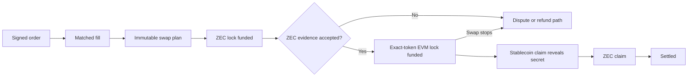

<p align="center">
  
</p>

<h1 align="center">Phlebas</h1>

<p align="center">
  <strong>Native transparent ZEC against exact Ethereum Mainnet stablecoins, settled from user-controlled wallets.</strong>
</p>

<p align="center">
  An offchain order book with one two-chain atomic swap for every matched fill.
</p>

<p align="center">
  <a href="https://phlebas.vercel.app"><strong>Open the public preview ↗</strong></a>
  ·
  <a href="#how-one-fill-settles">Settlement model</a>
  ·
  <a href="#run-locally">Run locally</a>
  ·
  <a href="#documentation">Documentation</a>
</p>

> [!WARNING]
> **Public preview only.** Phlebas currently uses synthetic markets and local browser state. No production contract, Zcash node, Zcash-wallet signing path, mainnet transaction, or real asset is connected. Nothing in this repository is an offer of financial services.

## Why Phlebas

Native ZEC and an EVM token cannot share one contract state. A conventional cross-chain pool would introduce wrapped assets, platform balances, or shared custody.

Phlebas takes a different route. The matcher coordinates signed orders while each party keeps its assets in its own wallet. A match creates an immutable two-chain swap plan. Verified evidence controls progress, and each funder retains a wallet-controlled refund path if the swap stops.

| | Phlebas design |
| --- | --- |
| **Markets** | `ZEC/USDC` and `ZEC/USDT` |
| **Base asset** | Native transparent ZEC on Zcash |
| **Quote assets** | Exact Ethereum Mainnet USDC and USDT contracts |
| **Custody** | None. Assets stay in user or solver wallets until a swap is authorized |
| **Matching** | Offchain, deterministic price-time priority |
| **Settlement** | One Zcash conditional lock and one exact-token EVM lock per fill |
| **Recovery** | Signed, staggered refund deadlines with mutually exclusive claim and refund outcomes |
| **Privacy** | Transparent settlement only in version 1 |
| **Live value** | Disabled pending wallet, contract, observer, legal, and release gates |

## Markets

| Market | Base settlement | Quote settlement | Quote identity |
| --- | --- | --- | --- |
| `ZEC/USDC` | Native transparent ZEC | Ethereum Mainnet USDC | `0xa0b86991c6218b36c1d19d4a2e9eb0ce3606eb48` |
| `ZEC/USDT` | Native transparent ZEC | Ethereum Mainnet USDT | `0xdac17f958d2ee523a2206206994597c13d831ec7` |

Both quote assets use 6 decimals. ZEC means native transparent ZEC on Zcash. It is not wrapped, minted, or represented as a Phlebas platform balance. USDT0 is not a listed settlement asset.

Wallet actions remain disabled until the exact matcher and per-fill `ConditionalLock` deployment manifests are approved.

## How one fill settles



1. Both parties authorize the exact fill terms, assets, amounts, recipients, chain identities, fees, hashlock, and deadlines.
2. The ZEC seller funds a native Zcash conditional lock with the longer refund deadline.
3. Policy-qualified observers confirm the exact Zcash outpoint.
4. The stablecoin seller funds an exact-token EVM conditional lock with the shorter refund deadline.
5. The ZEC seller claims the stablecoin and reveals the preimage.
6. After the EVM claim reaches the signed finality policy, the stablecoin seller uses that preimage to claim ZEC.
7. If the swap stops, each funder can recover through its wallet after the applicable deadline.

The matcher may sequence, omit, delay, or stop orders. It cannot settle a fill, redirect funds, or sign for either party. The target coordinator derives state only from verified evidence committed to a replayable journal.

## What makes the model different

| Design choice | Result |
| --- | --- |
| **One fill, one swap** | Every partial fill receives its own immutable assets, parties, hashlock, deadlines, and recovery route |
| **Wallet-held inventory** | Makers and solvers keep inventory in their own wallets. There is no shared LP token |
| **Evidence-gated progress** | Wrong-chain, stale, reorganized, or conflicting evidence moves the workflow to dispute |
| **Replayable state** | Hash-chained receipts, snapshots, and deterministic replay expose gaps and corruption |
| **Zero-fee invariant** | The reference engine rejects positive protocol fees until exact escrow splitting is proven |
| **Refund preserved** | Every incomplete funded swap retains the applicable wallet-controlled refund path |

Phlebas uses wallet-held maker and solver inventory instead of passive cross-chain LP shares. A solver may still use a constant-product curve to price its own inventory.

## Current implementation

> [!IMPORTANT]
> **Integration target, 01-09-2026:** a signed USDC buy-side order submitted to an accepting no-value matcher. The matcher can validate, sequence, and record the order, but it cannot move funds. ZEC sell-side submission remains disabled until a Zcash-wallet authorization format is integrated.

### Product surface

* Responsive landing page and trading terminal for `ZEC/USDC` and `ZEC/USDT`
* Dense order book, recent trades, chart, order ticket, open orders, fills, and settlement views
* In-browser price-time matcher with GTC, IOC, FOK, partial fills, cancellation, and deterministic replay
* Integer prices, sizes, quote amounts, fees, and side-aware rounding
* Click-to-price depth, worst-price market protection, and feed-state safety gates
* Native swap journey covering authorization, funding, observation, confirmation, claim, dispute, refund, expiry, and recovery states
* Responsive, keyboard, reduced-motion, and browser acceptance coverage

The terminal takes structural cues from professional order-book venues while using an original Phlebas visual system and explicit custody and settlement labels.

### Protocol domain

* Canonical order encoding, SHA-256 digests, and keccak EIP-712 typed-data hashes
* Exact chain and asset identities, deterministic fill IDs, and one swap ID per fill
* Immutable terms binding price, amounts, a zero-fee invariant, fee recipient, market policy, timing policy, observer policy, and chain-specific finality policies
* Exact Mainnet `SwapTermsV1` projection into one SHA-256 Zcash HTLC, including derived P2SH lock address, P2PKH claim and refund recipients, amount, funding cutoff, and timestamp refund lock
* Content-addressed Zcash funding, claim, and refund artifacts bound to the swap ID and terms hash, with confirmed-funding provenance required before either spend artifact can be constructed
* PCZT review bundles bind the exact swap, terms, artifact manifest, and header-checked PCZT bytes while remaining explicitly blocked on full ZIP 374 verification and a qualified wallet lifecycle
* Two-leg state machine with timestamped authorizations, artifact preparation, ZEC-first funding, causal chain-time checks, staggered refunds, mutually exclusive claim and refund outcomes, and policy-confirmed secret release
* Content-addressed funding and spend facts separated from observer attestations
* Quorum, confirmation-depth, execution-age, staleness, and source-allowlist checks
* Same-height observer disagreement forced into dispute
* Hash-chained receipts, deterministic replay, snapshot roots, corruption detection, and idempotency
* Fail-closed handling for conflicting evidence, abandoned artifacts, expiry, retraction, and replacement
* Deterministic, adversarial, replay, state-machine, contract, and browser tests

### Persistent matcher

The loopback-only matcher accepts authenticated order and solver intents, writes one hash-chained single-writer journal, maintains stable feed cursors, and recovers deterministically. It starts unconfigured, holds no keys, constructs no transactions, and cannot sign, broadcast, or move funds.

The repository still contains historical Arbitrum Sepolia artifacts, a persistent loopback matcher, atomic-swap observer reference code, and historical pZEC and AMM simulations. They are not active settlement targets. No local TEX issuance or custody gateway is part of the current runtime. The matcher starts unconfigured, holds no keys, constructs no transactions, and cannot sign, broadcast, or move funds. None of these local services may run on Vercel.

The older Fill observer service remains an untrusted diagnostic. It cannot authorize wallet actions. Replacing it with the journal-backed adapter is a release gate.

The active settlement architecture is recorded in [ADR 0002](docs/adr/0002-native-zec-atomic-settlement.md). The persistent no-value matcher boundary is recorded in [ADR 0003](docs/adr/0003-persistent-native-matcher.md).

## User journey

1. Select `ZEC/USDC` or `ZEC/USDT` and review market and system status.
2. Enter a limit order or an IOC market order with a signed worst price.
3. Review the exact network, asset, amount, recipient, fee cap, expiry, and allowed settlement route.
4. Sign the order authorization in the correct wallet.
5. Inspect the matcher receipt and one settlement ticket for each fill.
6. Sign only the wallet action supported by current chain evidence.
7. Finish as settled or refunded. Unsafe evidence keeps the ticket disputed and disables normal progress.

The public app demonstrates this journey without asset-moving wallet signing or chain broadcast.

## Run locally

### Requirements

* Node.js 24.x
* npm
* Chromium for browser tests
* Foundry for contract tests

```bash
npm ci --ignore-scripts
npx playwright install chromium
npm run dev
```

Open `http://localhost:3000`.

| Route | Purpose |
| --- | --- |
| `/` | Product landing page |
| `/trade` | Trading terminal and native settlement journey |
| `/liquidity` | Wallet-held solver quote interface |
| `/status` | Public preview status |
| `/api/status` | Machine-readable preview status |

## Validate the repository

Run the code, protocol, contract, secret, and production-build gates:

```bash
npm run check
```

Run the same gates with Playwright browser coverage:

```bash
npm run check:browser
```

Focused commands:

```bash
npm run lint
npm run typecheck
npm run test
npm run test:contracts
npm run scan:secrets
npm run build
npm run test:browser
```

See the [browser acceptance guide](docs/BROWSER_ACCEPTANCE.md) for the tested routes, viewports, interactions, and safety assertions.

## Repository map

| Path | Purpose |
| --- | --- |
| [`src/app`](src/app) | Next.js routes, status surfaces, and global styles |
| [`src/components`](src/components) | Landing, trading, liquidity, and settlement interfaces |
| [`src/lib`](src/lib) | Orders, matching, native swaps, replay, policies, and browser-safe domains |
| [`contracts`](contracts) | Undeployed EVM contract sources and local contract tests |
| [`services`](services) | Loopback matcher and read-only observer reference code |
| [`infra/testnet`](infra/testnet) | Key-free Testnet manifests and deployment records |
| [`docs`](docs) | Product, architecture, threat, operations, wallet, and delivery documentation |

```text
Browser interface
    │
    ├── local market and order preview
    ├── settlement state projection
    └── unsigned wallet review boundary

Loopback development services
    │
    ├── persistent matcher and replay journal
    └── read-only observer reference

Future value-bearing systems
    │
    ├── approved Zcash wallet path
    ├── reviewed EVM ConditionalLock
    └── independently operated chain evidence
```

<details>
<summary><strong>Matcher user controls</strong></summary>

`cancel-order` and `advance-epoch` are user-owned EIP-712 typed controls in the distinct `Phlebas Matcher Control` domain. They do not reuse the order-intent authorization.

A cancellation is verified against the accepted order's authorized signer, account epoch, and nonce. An epoch advance is verified for its account signer and invalidates that account's open orders. Neither control signs, constructs, broadcasts, or moves an asset transaction.

Every matcher mutation requires JSON, an `Idempotency-Key` equal to the payload `requestId`, and the exact active `x-phlebas-matcher-configuration` value. A successful response separates the historical `receiptCheckpoint` from the current `checkpoint`. An exact idempotent replay remains verifiable after later matcher activity advances the current head. Equal-sequence checkpoints must have the same record hash and state root.

New control ingress is marker-free and becomes `eip712-v1` inside the matcher. A one-time system event commits the legacy authorization cutoff to the hash chain. Old unmarked raw controls can replay only before that record. Fresh initialization resumes only exact canonical crash states and reserves journal capacity for the system cutover.

Cancellation review requires an immutable confirmed native buy artifact with an `open` or `partially-filled` receipt, plus fresh matcher health, account, wallet, and checkpoint state. Epoch review derives the next epoch from the fresh account state.

Confirmation repeats the matcher, account, checkpoint, and wallet checks, stops on drift, and requests only the reviewed EIP-712 signature. Network failures, server errors, malformed responses, and receipt mismatches become `receipt-unknown`. Retry revalidates the approved matcher identity and posts the frozen body and idempotency key without signing again.

Control artifacts are session-only. Account-scoped open-order recovery requires a fresh single-use EIP-712 authorization for every page, strict cursor and checkpoint continuity, and no signature retention. The terminal does not expose recovery while both tracked matcher manifests remain disabled.

</details>

<details>
<summary><strong>Optional loopback services and legacy surfaces</strong></summary>

Start the isolated matcher only on a local development machine:

```bash
npm run matcher
```

```text
PHLEBAS_MATCHER_USDC_URL=http://127.0.0.1:8788
PHLEBAS_MATCHER_USDT_URL=http://127.0.0.1:8789
```

Never set these values on Vercel. See [`services/README.md`](services/README.md) for the isolated Compose workflow.

The repository retains an undeployed Arbitrum Sepolia contract candidate, atomic-swap observer reference code, and historical pZEC and AMM simulations. No local TEX issuance or custody gateway is part of the current runtime. The former browser transaction submitter, public activation flag, and package activation command have been removed.

</details>

## Safety boundaries

### Wallet boundary

Phlebas may prepare an unsigned, reviewable transaction artifact. It must never request, receive, store, or log:

* a seed phrase
* a Zcash spending key or viewing key
* an EVM private key
* a wallet database
* a blind signature
* an unrestricted token approval

No Zcash wallet is Phlebas verified today. Compatibility requires executed Testnet evidence for transparent funding, claim, timeout refund, fees, restart, and reorganization. ZIP 321 and TEX payment support alone do not prove atomic-swap compatibility.

### Deployment boundary

Vercel may host the public interface, static documentation, read-only public market and status data, and browser-side preparation of unsigned terms. It must never host private node credentials, wallet keys, an authoritative matcher or swap journal, or any service that can sign, claim, refund, redirect, or custody funds.

None of the local matcher or observer services may run on Vercel.

### Release boundary

Every pull request must pass focused tests, the full repository check, secret scanning, independent review, GitHub checks, and an exact-commit Vercel preview.

Testnet execution still requires exact Zcash transaction construction, reviewed EVM escrow code, current chain policies, observer recovery drills, wallet compatibility evidence, legal review, and explicit authorization.

Mainnet also requires successful Testnet operation, independent audits, reproducible services and contracts, production identities, monitoring, incident drills, exact deployment manifests, and separate authorization for real assets.

## Documentation

| Document | Read it for |
| --- | --- |
| [Product specification](docs/PRODUCT_SPEC.md) | Markets, orders, settlement, liquidity, and user journeys |
| [Architecture](docs/ARCHITECTURE.md) | Current boundaries and target system topology |
| [Native settlement ADR](docs/adr/0002-native-zec-atomic-settlement.md) | The active two-chain settlement decision |
| [Persistent matcher ADR](docs/adr/0003-persistent-native-matcher.md) | Matcher persistence, recovery, HTTP, and no-value limits |
| [Threat model](docs/THREAT_MODEL.md) | Threats, controls, tests, and stop conditions |
| [Wallet compatibility](docs/WALLET_COMPATIBILITY.md) | Wallet evidence and Testnet qualification |
| [Zcash transaction lab](docs/ZCASH_TRANSACTION_LAB.md) | Transparent HTLC and unsigned artifact boundaries |
| [Operations](docs/OPERATIONS.md) | Service, recovery, observability, and incident requirements |
| [Delivery plan](docs/DELIVERY_PLAN.md) | Build sequence, acceptance gates, and release protocol |
| [Mainnet deployment runbook](docs/MAINNET_DEPLOYMENT.md) | Settlement contract deployment, evidence recording, and matcher activation |
| [Sources](docs/SOURCES.md) | Primary protocol, contract, wallet, and regulatory references |

## Contributing and security

Read [CONTRIBUTING.md](CONTRIBUTING.md) before proposing a change. Report security issues through the process in [SECURITY.md](SECURITY.md). Do not open a public issue containing a credential, private key, seed phrase, wallet database, identity document, or non-public vulnerability detail.

## License

Phlebas is licensed under the Apache License 2.0. See [LICENSE](LICENSE) and [the license choice](docs/LICENSE_CHOICE.md).
