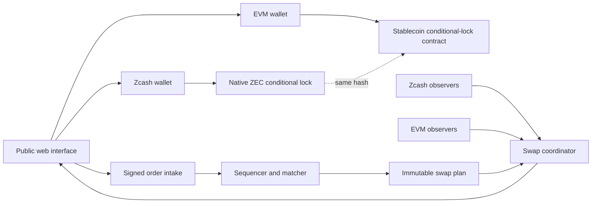

# Phlebas Architecture

Status: native-settlement target, no-value simulation
Updated: 01-09-2026

Phlebas is being built as a non-custodial exchange for native transparent ZEC against USDC and USDT. The current public application is a no-value browser simulation. Optional loopback stubs exist for a textest gateway, matcher, and observer, and an optional wallet connector is limited to undeployed Arbitrum Sepolia terms. Those services are never hosted on Vercel and do not move mainnet funds.

No Phlebas contract is deployed. No Zcash node, production signer, reserve account, custody process, transaction, or real asset is connected. Every balance, order, trade, pool, price, and transaction shown by the public application is simulated.

[ADR 0002](adr/0002-native-zec-atomic-settlement.md) supersedes the custody-backed pZEC design in ADR 0001.

## Product boundary

The target markets are:

* `ZEC/USDC`
* `ZEC/USDT`

`ZEC` means native transparent ZEC on Zcash. It never becomes a Phlebas receipt or platform balance. The quote asset remains the exact issuer-approved token on the selected EVM chain.

Each fill settles through a pair of chain-native conditional locks. The matcher does not control either lock. Users and solvers sign asset-moving transactions in their own wallet boundary.

Version 1 is transparent. It does not provide shielded settlement or privacy.

## Current system

The current repository contains a Next.js no-value simulation, undeployed Arbitrum Sepolia contract sources, and optional loopback operator stubs. Public Vercel must not run the gateway, matcher, or observer.

| Component | Current state | Target state |
| --- | --- | --- |
| Web application | Vercel-hosted no-value simulation | Public interface and unsigned transaction preparation |
| Market data | Illustrative fixtures plus session fills | Signed and independently monitored public feeds |
| Order book | In-browser matcher and optional loopback operator | Persistent signed-order matcher with receipts |
| Settlement | Local inventory updates and undeployed legacy Sepolia contracts | One two-chain atomic swap per fill |
| Zcash path | Local textest gateway, ZIP 321, TEX, and payout-tour stubs | Transparent P2SH fund, claim, and refund transactions |
| EVM path | Optional Sepolia wallet flow against an undeployed legacy manifest | Exact-token conditional-lock contract |
| Liquidity | Superseded pZEC AMM and LP previews | Wallet-held maker and solver quotes |
| Wallets | Optional EIP-1193 testnet flow; no native swap adapter | Explicit adapters that keep every key in the wallet |
| Observers | Optional loopback textest stub | Independent read-only Zcash and EVM evidence |
| Coordinator | None | Persistent state, recovery, and safe-action policy |

The historical pZEC gateway and reserve model remains in the repository while the simulation UI is migrated. It is not the active target and must not receive new production functionality.

## Target topology



The dotted relationship is data, not custody. Both legs bind the same approved hash and use different refund deadlines.

## Fill and settlement lifecycle

One fill creates one immutable, independently replayable swap workflow. The reference domain uses these derived phases:

```text
awaiting authorizations
  -> awaiting ZEC funding
  -> awaiting ZEC confirmation
  -> awaiting EVM funding
  -> awaiting EVM confirmation
  -> awaiting EVM claim
  -> secret observed
  -> awaiting ZEC claim
  -> settled

funded leg -> refund recovery -> refunded
unsafe or conflicting evidence -> disputed
no chain evidence after the active signed deadline -> expired
```

Each partial fill has a unique fill index and creates a separate swap identifier. A match is never presented as settled. Exact terms are separately authorized by both swap parties because an order signature does not authorize per-fill hashlocks, deadlines, destinations, or contract identities.

The candidate funding order is:

1. The native-ZEC seller funds the Zcash leg with the longer refund deadline.
2. Independent observers wait for the approved Zcash confirmation policy.
3. The stablecoin seller funds the EVM leg with the shorter refund deadline.
4. The ZEC seller claims the stablecoin and reveals the preimage.
5. The stablecoin seller uses that preimage to claim native ZEC.
6. If progress stops, each funder uses its own wallet-controlled refund path after the applicable deadline.

The local state machine enforces strict deadline ordering and a configurable minimum safety margin. Fixture durations are synthetic. Production durations remain unset until current protocol analysis and adversarial Testnet evidence approve a versioned timeout policy.

The hashlock is SHA-256 with a 32-byte preimage. The canonical terms digest, swap identifier, event chain, and snapshot root also use SHA-256. A successful canonical EVM claim observation records the public preimage, but it becomes claim authority only after the exact chain fact satisfies the signed observer and finality policies. Failed calls and conflicting observations do not create claim authority. Once publicly revealed, the secret remains known even if the reveal transaction reorganizes.

Every finality quorum must agree on one exact observer tip height and block hash. Reports for the same fact that disagree on that view remain auditable but force the swap into dispute. The reference engine also requires `protocolFeeQuoteAtoms` to be zero until the exact-token EVM escrow proves a separate fee transfer without reducing or redirecting either signed principal amount.

Authorization times and funding-artifact preparation times are persisted in the state root. Funding cannot predate both authorizations or its prepared artifact, EVM funding cannot predate policy-confirmed ZEC funding, and a spend cannot predate its own funded and confirmed leg. Replacement resolutions retain the leg, evidence kind, fact, old observer, and new observer so a state root cannot redirect recovery provenance to an unrelated active report.

## Zcash leg

The candidate Zcash leg uses transparent P2SH. The [Zcash protocol specification](https://zips.z.cash/protocol/protocol.pdf) states that transparent addresses include P2SH and that BIP 16 and BIP 65 apply from genesis. [ZIP 300](https://zips.z.cash/zip-0300) gives a candidate transparent atomic-swap construction with a hash-protected claim branch and a lock-time refund branch. [BIP 65](https://github.com/bitcoin/bips/blob/master/bip-0065.mediawiki) defines `OP_CHECKLOCKTIMEVERIFY` lock-time semantics.

The final implementation must verify:

* the exact redeem script and script hash;
* network and transaction-version rules;
* the shared hash function and byte order;
* sighash and signature encoding;
* lock-time type and transaction sequence;
* standardness and relay policy;
* fee and change construction;
* transaction expiry and replacement behavior;
* confirmation and reorganization policy;
* wallet review, signature, broadcast, claim, and refund support.

No repository fixture may contain a real key, funded address, private endpoint, or executable mainnet transaction.

## EVM leg

The candidate EVM leg is a non-upgradeable exact-token contract with these operations:

* fund one immutable swap;
* claim with the exact preimage before expiry;
* refund to the original funder after expiry;
* read swap terms and terminal state.

The contract has no token registry controlled by an administrator, callback, arbitrary recipient change, protocol balance, seizure path, hidden fee, proxy, or upgrade path.

USDC is the first quote candidate. Circle publishes its [current contract registry](https://developers.circle.com/stablecoins/usdc-contract-addresses). USDT and USDT0 remain unresolved until one exact asset, chain, contract, proxy, admin model, and issuer policy is approved.

Contract code and test dependencies remain local until Testnet deployment receives separate approval.

## Order book

The matcher accepts versioned signed orders that bind:

* maker and recipient;
* side;
* base and quote asset identities;
* native and EVM network identities;
* base amount and limit price;
* nonce and account epoch;
* expiry and salt;
* maximum fee;
* allowed settlement route;
* protocol version and verifying domain.

EVM authorization uses [EIP-712](https://eips.ethereum.org/EIPS/eip-712). Zcash wallet authorization requires a separate, wallet-supported format. The matcher cannot treat an EVM signature as authority over ZEC.

Price-time matching, GTC, IOC, FOK, partial fills, cancellation, fee caps, and side-aware integer rounding are deterministic. Sequence receipts and checkpoints make omission or reordering visible. They do not make the matcher trustless.

## Solver liquidity

Makers and solvers keep assets in their own wallets. They publish signed quotes that bind capacity, price, fee, expiry, networks, assets, and recipients. The quote may be calculated from a constant-product curve or inventory-skew strategy.

Accepting a quote creates one atomic-swap workflow. It does not transfer inventory into Phlebas.

A standard Uniswap v2 pool requires both assets in one contract state. Native ZEC and an EVM stablecoin do not meet that condition. The product must not describe solver liquidity as passive LP shares or a Uniswap v2 pool.

## Wallet boundary

Phlebas may prepare an unsigned transaction artifact and show the exact terms. The wallet performs review and signing.

Phlebas never requests or stores:

* a seed phrase;
* a Zcash spending key or viewing key;
* an EVM private key;
* a wallet database;
* an unrestricted signature;
* a blind transaction approval.

The user sees asset, amount, network, recipient, hash, deadline, fee, privacy effect, and refund path before every signature.

The [Zallet PCZT interface](https://zcash.github.io/zallet/rpc/index.html) separates creation, inspection, signing, and extraction. That interface is a candidate adapter, not proof that a current wallet can safely complete the exact P2SH swap. Compatibility labels require executed tests.

## Observers and coordinator

At least two independent Zcash observations and two independent EVM observations feed the coordinator. The exact provider and node diversity policy remains a release decision.

Chain facts are content-addressed separately from observer attestations. A funding or spend fact binds:

* network and chain identity;
* block height or number;
* block hash;
* transaction identifier;
* output or log index;
* contract or script identity;
* amount;
* execution time;
* exact funded outpoint or escrow record;
* action, recipient, and preimage when applicable.

Each attestation then binds one fact ID, observer source, signed observer policy, signed chain-specific finality policy, observation time, and observed chain tip. Confirmation is derived from the policy's source quorum, confirmation depth, execution age, and freshness limits. No boolean observer field can declare a fact final.

The coordinator stores an append-only journal and derives the current state by deterministic replay. It recommends a wallet action but cannot sign it.

Observer disagreement, staleness, wrong-chain evidence, wrong-asset evidence, conflicting replacement, or reorganization moves the workflow to `disputed`. Exact duplicate events are idempotent. Automatic funding and claim progress stops until a versioned recovery rule has enough evidence. An unbroadcast funding artifact may be abandoned. A swap with no observed chain evidence may expire after its active signed deadline. A retracted unconfirmed observer report may be replaced only by a new approved attestation for the same canonical fact, with the retraction and resolution retained in the state root and journal. Confirmed or conflicting chain facts require manual recovery and cannot use this replacement path. A refund deadline is derived chain-time eligibility, not proof that an output remains unspent or that a refund occurred.

Every journal receipt binds the swap identifier, terms hash, global sequence, previous event hash, semantic slot, prior state root, and next state root. Event payloads use strict known discriminants and exact runtime fields. A snapshot binds the complete journal head and replayed state, including terminal, dispute, retraction, and resolution metadata. Missing, truncated, reordered, unknown, conflicting, unreplayable, or root-mismatched persistence fails closed.

## Service and deployment boundaries

Vercel may host:

* the public interface;
* static documentation;
* read-only public status and market routes;
* browser-side preparation of unsigned order and swap terms.

Vercel must not host:

* wallet keys or transaction signing;
* private node credentials;
* the authoritative order or swap journal;
* observer credentials;
* a contract deployer;
* any service that can spend, claim, refund, redirect, or custody assets.

Persistent matcher, observer, coordinator, and watchtower services run in separate private infrastructure with least-privilege identities and audited release manifests.

## Environments

| Environment | Assets | Keys | Network actions | Public claim |
| --- | --- | --- | --- | --- |
| Local | Synthetic only | Deterministic disposable local keys when a test requires them | Local processes only | Simulation |
| Preview | Synthetic only | None | No chain connections | No-value preview |
| Closed Testnet | Testnet only | Approved test identities | Exact approved procedures | Testnet |
| Public Testnet | Testnet only | Approved test identities | Monitored and capped | Testnet |
| Mainnet | Real assets | Production controls | Separately approved manifest | Live exchange |

An environment variable cannot promote one environment to another. Mainnet code paths require an exact compiled manifest, build-time gate, runtime allowlist, and deployment approval.

## Failure policy

Phlebas fails closed on:

* invalid or expired signatures;
* nonce, account-epoch, or replay conflict;
* stale or disagreeing observations;
* wrong network, token, contract, script, recipient, amount, or hash;
* unsafe deadline ordering;
* duplicate transaction or swap identifier;
* claim and refund conflict;
* chain reorganization beyond the active policy;
* matcher sequence gap;
* coordinator journal mismatch;
* wallet adapter mismatch;
* contract pause or code-hash mismatch.

Failing closed preserves the user's refund route whenever the chain permits it. A service outage must not give Phlebas a new spending power.

## Release gate

Testnet needs current protocol evidence, deterministic vectors, local execution, adversarial timeout tests, wallet compatibility tests, independent contract and transaction-builder review, observer recovery tests, legal review, and explicit approval.

Mainnet needs successful Testnet operation, independent audits, exact contract and service identities, reproducible builds, verified bytecode, monitoring, incident drills, legal approval, and separate authorization for real assets.

The current Vercel deployment remains a simulation until every applicable gate passes.
