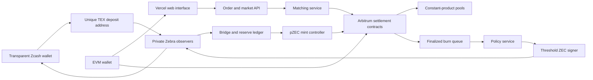

# Phlebas Architecture

Status: Simulation only
As of: 31-08-2026

Phlebas is a user interface and protocol design for ZEC markets. The public app does not accept live deposits, hold assets, or move mainnet funds. Optional loopback stubs exist for a textest gateway, matcher, and observer. They are never hosted on Vercel.

No Phlebas contracts are deployed. No Zcash node, signer, reserve account, or custody process is operating. Every balance, order, trade, pool, price, and transaction shown by the public application is simulated.

The candidate mainnet design remains gated by the controls in [Mainnet gate](#mainnet-gate). This document does not authorize deployment or custody.

## Product boundary

The target product has two displayed markets:

* `ZEC/USDC`
* `ZEC/USDT`

The candidate settlement assets on Arbitrum One are:

* `pZEC/USDC`
* `pZEC/USDT0`

`pZEC` means Phlebas ZEC. It would be an 8-decimal ERC-20 claim backed one for one by transparent native ZEC held by a custody operator. It would not be native ZEC, shielded ZEC, a privacy asset, or a trustless bridge asset.

Phlebas would accept transparent Zcash deposits only. Transparent Zcash exposes transaction and balance information publicly, as described by [Zcash's comparison of transparent and shielded ZEC](https://z.cash/learn/what-is-the-difference-between-shielded-and-transparent-zcash/).

## Architecture decision

The candidate design uses custody-backed `pZEC` because both requested market structures need a common settlement environment:

* A central limit order book can match signed orders and settle ERC-20 transfers.
* A Uniswap v2 style pool requires two ERC-20 reserves in one contract and issues fungible ERC-20 LP shares. The [Uniswap protocol description](https://developers.uniswap.org/docs/get-started/concepts/how-uniswap-works) states these properties directly.

Native transparent ZEC can support bilateral hash time-locked swaps. [ZIP 300](https://zips.z.cash/zip-0300) specifies a proposed transparent P2SH atomic-swap protocol. It remains Proposed and says the approach had not achieved widespread adoption. A native ZEC atomic-swap lane could settle matched orders, but it cannot by itself create a single-state Uniswap v2 pool. Phlebas therefore treats atomic swaps as a possible later settlement route, not the base for the LP system.

The chain and asset choice is recorded in [ADR 0001](adr/0001-arbitrum-and-pzec.md).

## Current system

The current repository contains a Next.js no-value simulation, undeployed Arbitrum Sepolia contract sources, and optional loopback operator stubs. Public Vercel must not run the gateway, matcher, or observer.

| Component | Current state | Candidate gated state |
| --- | --- | --- |
| Web application | Local or Vercel-compatible simulation (noindex) | Public interface with explicit network and asset disclosures |
| Market data | Static sample values plus session fills | Indexed contract events and signed service responses |
| Order book | In-browser matcher; optional loopback operator stubs | Off-chain order intake and matching with on-chain settlement |
| LP pools | In-memory constant-product calculation | Audited `pZEC/USDC` and `pZEC/USDT0` contracts |
| Zcash deposits | Local textest gateway stub, off by default | Fresh per-intent TEX addresses with final-transaction transparency checks |
| Zcash withdrawals | Tour-only payout stub; nothing is sent | Burn-authorized transparent withdrawals |
| `pZEC` | Display label; undeployed contract source | Custody-backed ERC-20 with controlled mint and burn |
| Custody | None | Approved operator, threshold policy, reserve ledger, and recovery plan |
| Wallets | Optional EIP-1193 on Arbitrum Sepolia, signing disabled until verified deployment | Production wallet path after launch gates |

## Candidate topology

The following diagram describes a gated target. It does not describe deployed infrastructure.

Vercel may host the web interface and stateless public routes. It must not host the Zebra data directory, reserve ledger, signer, private keys, custody controls, or withdrawal queue. Zebra currently needs persistent storage. The [Zebra system requirements](https://zebra.zfnd.org/user/requirements.html) list about 300 GB for cached mainnet data as of 30-08-2026.

## Zcash network dependency

Zebra is the candidate consensus node. `zcashd` reached end of life, halted at block `3,417,100` on 18-07-2026, and does not support NU6.3, according to the [official deprecation notice](https://z.cash/support/zcashd-deprecation/). Ironwood NU6.3 activated at block `3,428,143` on 28-07-2026, according to the [NU6.3 activation page](https://z.cash/upgrade/nu6-3/). The latest release checked for this design was [Zebra 6.3.0](https://github.com/ZcashFoundation/zebra/releases/latest), released 10-08-2026.

Zebra provides chain validation and RPC methods. It does not provide a wallet. Its RPC server is disabled by default and uses cookie authentication by default, as documented in the [Zebra RPC guide](https://zebra.zfnd.org/user/docker.html). The RPC endpoint must stay on a private network.

[Zallet](https://zcash.github.io/zallet/) is the intended wallet replacement, but it is beta software, has not been fully reviewed, may make breaking changes, and still lacks several planned RPC methods. Phlebas may use Zallet for test integration. The production custody design must not depend on Zallet as its sole signer or wallet boundary while those warnings remain.

## Transparent ZEC deposit flow

No part of this flow is active today.

1. The address service derives a fresh P2PKH receiver for one deposit intent, presents its ZIP 320 `tex...` encoding, and never reassigns the receiver.
2. The observer records the expected address without importing a spend key.
3. Zebra detects an output and returns the raw transaction, output index, block hash, and block height.
4. The deposit validator confirms the network, output script, amount, and unique `(txid, vout)` key.
5. The validator checks that the deposit transaction contains only transparent inputs and transparent outputs. A nonconforming transaction is quarantined for manual review and is not auto-credited.
6. The deposit remains provisional until the confirmation policy is met.
7. The reserve ledger creates a confirmed deposit entitlement.
8. A separate mint policy may authorize the same integer amount of `pZEC` after all mainnet controls pass.

[ZIP 320](https://zips.z.cash/zip-0320), Active since 12-01-2024, defines TEX as a Bech32m re-encoding of a transparent P2PKH address. Sending wallets must use only transparent UTXOs when paying a TEX address. This rule is not enforced by Zcash consensus. Phlebas must inspect the final deposit transaction instead of trusting the address prefix alone.

TEX proves no lifetime provenance. A transparent UTXO may have been created by an earlier transfer out of a shielded pool. The mainnet product must state whether "transparent only" means the final deposit transaction or all traceable ancestry. The candidate policy covers the final deposit transaction only.

## Confirmations and reorganization handling

External deposits are untrusted transaction outputs. [ZIP 315](https://zips.z.cash/zip-0315), which remains Draft, recommends 10 confirmations for untrusted outputs and 3 for trusted outputs. Ten confirmations is the development and testnet observation minimum. The restricted-mainnet canary design starts at 100 confirmations and at least two hours, whichever is later, with value-based tiers allowed to become more conservative after formal review.

[ZIP 203](https://zips.z.cash/zip-0203) says services must never rely on zero-confirmation Zcash transactions. It also defines transaction expiry and a default expiry delta of 40 blocks at the current 75-second target spacing.

The deposit service stores the block hash and height for every observed outpoint. A reorganization causes it to:

* remove orphaned provisional deposits;
* find transactions that were included again on the new chain;
* recalculate confirmations from the new tip;
* stop minting and withdrawals if an already credited deposit is removed;
* reconcile the reserve and liability ledgers before resuming.

Ten confirmations are a risk policy, not absolute finality. Confirmation policy is expressed in blocks and risk tiers, not fixed minutes. NU7 has no activation height as of 30-08-2026. [Draft ZIP 218](https://zips.z.cash/zip-0218) proposes changing target spacing from 75 seconds to 25 seconds, so wall-clock assumptions may change.

## Withdrawal flow

No part of this flow is active today.

1. The user requests a transparent Zcash withdrawal and sees the gross amount, network fee, service fee, and net amount.
2. After destination and amount validation, the user burns the required `pZEC`. The first implementation does not create a native payout liability from escrowed tokens.
3. The bridge waits for the configured Arbitrum finality condition, consumes the burn event once, and records the native payout liability.
4. The reserve ledger moves the amount from outstanding `pZEC` liability to native withdrawal payable.
5. The policy service validates the destination, amount, limits, available UTXOs, fee, and change output.
6. A threshold signer signs the approved transaction without exposing keys to the application, matching service, or Zebra node. Before release, the coordinator durably records its exact bytes, canonical transaction ID, and selected-input reservation.
7. Zebra broadcasts the signed transaction with `sendrawtransaction`.
8. The observer tracks mined, confirmed, expired, replaced, and reorganized states.
9. The ledger closes the payable only after the configured confirmation rule is met.

An unrecoverable failure before signature commitment may restore pZEC only through a single-use refund authorization that permanently cancels the unpaid claim. Once a native transaction is signed, the claim cannot be refunded and remains payable. An unresolved transaction may regain in-transit accounting only after independent observation of the exact committed transaction ID. A failed signed transaction reverses its input accounting only after independent proof that the exact inputs are spendable again and the signed transaction cannot confirm under the custody policy.

Zcash transaction fees must use integer zatoshis. [ZIP 317](https://zips.z.cash/zip-0317), last updated 26-06-2026, defines the conventional fee as `5,000 zatoshis * max(2, logical_actions)`. The transaction builder should also query current node policy and must not hard-code a permanent flat fee.

Transparent P2SH multisig exists on the network, but current wallet standardization is unfinished. [Draft ZIP 48](https://zips.z.cash/zip-0048) documents deterministic transparent multisig and a PCZT workflow, while also noting the lack of an established Zcash-compatible hardware-wallet approach. The mainnet gate therefore requires evidence for the exact HSM, MPC, or multisig signer used in production.

## Arbitrum settlement

Arbitrum One is the candidate settlement chain, not a deployed environment. The [Arbitrum documentation](https://docs.arbitrum.io/) supports Solidity contracts and ERC-20 transfers and was last updated 18-08-2026. The official [USDT0 deployment registry](https://docs.usdt0.to/technical-documentation/deployments) identifies Arbitrum One as chain ID `42161`.

The candidate quote assets are:

| Product label | Candidate settlement asset | Source checked on 30-08-2026 |
| --- | --- | --- |
| `ZEC/USDC` | Native Circle USDC on Arbitrum | [Circle USDC address registry](https://developers.circle.com/stablecoins/usdc-contract-addresses) |
| `ZEC/USDT` | USDT0 integration using the Arbitrum token entry | [USDT0 deployment registry](https://docs.usdt0.to/technical-documentation/deployments) |

Contract addresses are intentionally not configuration in the current application. The mainnet gate must reverify chain ID, bytecode, proxy and admin structure, token decimals, issuer documentation, and exact addresses from primary sources before any deployment.

## Order book and pool behavior

The candidate CLOB separates matching from settlement:

* Users sign bounded orders with market, side, price, quantity, expiry, nonce, and chain domain.
* The matching service orders compatible bids and asks without taking custody of user signing keys.
* Settlement contracts enforce signatures, nonces, limits, fees, and asset transfers.
* Cancellations invalidate unused order quantity.
* Partial fills update filled quantity atomically.

The candidate LP layer has one constant-product pool per quote asset. Each pool holds `pZEC` and one approved quote token, applies its configured fee, and issues fungible LP shares. The current interface's `0.30%` fee and sample reserves are simulation values, not approved mainnet parameters.

The router may compare executable CLOB liquidity with pool output. It must never present a simulated quote as executable or combine paths whose settlement cannot complete atomically.

## Trust and security model

`pZEC` introduces custody. Token holders depend on the custody operator to keep native ZEC reserves, protect signing authority, honor burns, and prevent unauthorized minting. Smart-contract self-custody on Arbitrum does not remove the native reserve dependency.

The bridge enforces the accounting rules in [Asset and Accounting](ASSET_AND_ACCOUNTING.md). The minimum controls are:

* separate observer, ledger, mint controller, and signer duties;
* no spend keys in the frontend, Vercel environment, matching service, or Zebra process;
* a limited hot withdrawal tier and threshold-controlled reserve storage;
* deterministic, idempotent processing of Zcash outpoints and Arbitrum events;
* daily supply and reserve reconciliation, plus reconciliation after every reorganization;
* immediate mint and withdrawal halt on reserve, node, signer, or chain disagreement;
* tested backup, restore, key rotation, and disaster recovery procedures;
* public disclosure that `pZEC` is custody-backed and transparent-only.

## Failure policy

| Condition | Required response |
| --- | --- |
| Zebra is behind the network tip | Pause deposit credit and native withdrawals |
| Zebra observers disagree | Pause all bridge state transitions |
| Deposit reorganization before mint | Remove the provisional entitlement |
| Deposit reorganization after mint | Halt minting and withdrawals, isolate affected accounts, reconcile the deficit |
| Arbitrum mint or burn reorganization | Roll back only unfinalized ledger state and never release native ZEC from an unfinalized burn |
| Reserve is below customer liabilities | Halt minting and withdrawals, preserve records, begin incident response |
| Signer or policy service is unavailable | Queue no new signing operation and preserve approved requests |
| Token identity or chain ID differs from configuration | Reject the transaction and halt that market |

## Environments

| Environment | Permitted use | Assets |
| --- | --- | --- |
| Local simulation | Interface and deterministic logic tests | No chain assets |
| Public preview | Read-only product demonstration | No chain assets |
| Test environment | Contract and node integration after separate approval | Valueless test assets only |
| Mainnet | Prohibited until every mainnet gate passes | Real assets only after explicit authorization |

The interface must label simulation and test environments. It must not display fabricated values as live market or reserve data.

## Mainnet gate

Mainnet remains blocked until all of the following have named owners, evidence, and explicit approval:

* legal analysis for custody, exchange operation, sanctions, money transmission, customer disclosures, and supported jurisdictions;
* independent audits of `pZEC`, mint and burn controls, settlement contracts, order handling, router, and LP contracts;
* a reviewed custody policy with exact signer technology, quorum, key generation, backups, rotation, and recovery;
* live Zebra redundancy, private RPC controls, upgrade monitoring, and tested reorganization recovery;
* stable Zcash wallet or independently audited transparent transaction builder and signer, without relying on beta Zallet as the production boundary;
* proof that every configured chain ID and token address matches current primary sources and expected bytecode;
* double-entry reserve accounting, invariant monitoring, public reserve disclosure, and independent attestation design;
* deposit, mint, burn, withdrawal, expiry, and deep-reorganization tests across both chains;
* rate limits, withdrawal limits, market controls, monitoring, incident response, and an emergency pause process;
* a liquidity and market-integrity plan for the CLOB and both pools;
* explicit approval to deploy contracts and establish operational custody.
