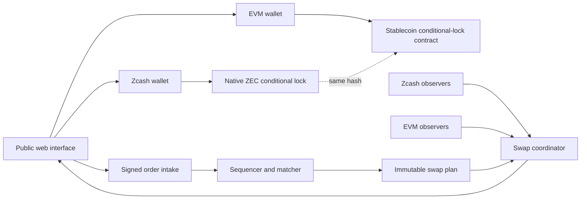

# Phlebas Architecture

Status: native-settlement target, simulation implementation
Updated: 31-08-2026

Phlebas is being built as a non-custodial exchange for native transparent ZEC against USDC and USDT. The current public application is a no-value browser simulation. Optional loopback stubs exist for a textest gateway, matcher, and observer, and an optional wallet connector is limited to undeployed Arbitrum Sepolia terms. Those services are never hosted on Vercel and do not move mainnet funds.

No Phlebas contract is deployed. No Zcash node, production signer, reserve account, custody process, transaction, or real asset is connected. Every balance, order, trade, pool, price, and transaction shown by the public application is simulated.

[ADR 0002](adr/0002-native-zec-atomic-settlement.md) supersedes the custody-backed pZEC design in ADR 0001.

## Product boundary

The target markets are:

* `ZEC/USDC`
* `ZEC/USDT`

`ZEC` means native transparent ZEC on Zcash. It never becomes a Phlebas receipt or platform balance. The quote asset remains the exact issuer-approved token on the selected EVM chain.

Each fill settles through a pair of chain-native conditional locks. The matcher does not control either lock. Users and solvers sign asset-moving transactions in their own wallet boundary.

Version 1 is transparent. It does not provide shielded settlement or privacy.

## Current system

The current repository contains a Next.js no-value simulation, undeployed Arbitrum Sepolia contract sources, and optional loopback operator stubs. Public Vercel must not run the gateway, matcher, or observer.

| Component | Current state | Target state |
| --- | --- | --- |
| Web application | Vercel-hosted no-value simulation | Public interface and unsigned transaction preparation |
| Market data | Illustrative fixtures plus session fills | Signed and independently monitored public feeds |
| Order book | In-browser matcher and optional loopback operator | Persistent signed-order matcher with receipts |
| Settlement | Local inventory updates and undeployed legacy Sepolia contracts | One two-chain atomic swap per fill |
| Zcash path | Local textest gateway, ZIP 321, TEX, and payout-tour stubs | Transparent P2SH fund, claim, and refund transactions |
| EVM path | Optional Sepolia wallet flow against an undeployed legacy manifest | Exact-token conditional-lock contract |
| Liquidity | Superseded pZEC AMM and LP previews | Wallet-held maker and solver quotes |
| Wallets | Optional EIP-1193 testnet flow; no native swap adapter | Explicit adapters that keep every key in the wallet |
| Observers | Optional loopback textest stub | Independent read-only Zcash and EVM evidence |
| Coordinator | None | Persistent state, recovery, and safe-action policy |

The historical pZEC gateway and reserve model remains in the repository while the simulation UI is migrated. It is not the active target and must not receive new production functionality.

## Target topology



The dotted relationship is data, not custody. Both legs bind the same approved hash and use different refund deadlines.

## Fill and settlement lifecycle

One fill creates one immutable swap workflow:

```text
matched
  -> terms accepted
  -> first leg funding prepared
  -> first leg funded
  -> first leg confirmed
  -> second leg funding prepared
  -> both legs funded
  -> redeemable
  -> settled

first leg funded -> first leg refundable -> first leg refunded
both legs funded -> second leg refundable -> second leg refunded
any observed state -> disputed
```

Each partial fill creates a separate workflow. A match is never presented as settled.

The candidate funding order is:

1. The native-ZEC seller funds the Zcash leg with the longer refund deadline.
2. Independent observers wait for the approved Zcash confirmation policy.
3. The stablecoin seller funds the EVM leg with the shorter refund deadline.
4. The ZEC seller claims the stablecoin and reveals the preimage.
5. The stablecoin seller uses that preimage to claim native ZEC.
6. If progress stops, each funder uses its own wallet-controlled refund path after the applicable deadline.

The exact funding order and deadline margin require current protocol analysis and adversarial Testnet evidence. The local state machine must treat them as versioned policy.

## Zcash leg

The candidate Zcash leg uses transparent P2SH. The [Zcash protocol specification](https://zips.z.cash/protocol/protocol.pdf) states that transparent addresses include P2SH and that BIP 16 and BIP 65 apply from genesis. [ZIP 300](https://zips.z.cash/zip-0300) gives a candidate transparent atomic-swap construction with a hash-protected claim branch and a lock-time refund branch. [BIP 65](https://github.com/bitcoin/bips/blob/master/bip-0065.mediawiki) defines `OP_CHECKLOCKTIMEVERIFY` lock-time semantics.

The final implementation must verify:

* the exact redeem script and script hash;
* network and transaction-version rules;
* the shared hash function and byte order;
* sighash and signature encoding;
* lock-time type and transaction sequence;
* standardness and relay policy;
* fee and change construction;
* transaction expiry and replacement behavior;
* confirmation and reorganization policy;
* wallet review, signature, broadcast, claim, and refund support.

No repository fixture may contain a real key, funded address, private endpoint, or executable mainnet transaction.

## EVM leg

The candidate EVM leg is a non-upgradeable exact-token contract with these operations:

* fund one immutable swap;
* claim with the exact preimage before expiry;
* refund to the original funder after expiry;
* read swap terms and terminal state.

The contract has no token registry controlled by an administrator, callback, arbitrary recipient change, protocol balance, seizure path, hidden fee, proxy, or upgrade path.

USDC is the first quote candidate. Circle publishes its [current contract registry](https://developers.circle.com/stablecoins/usdc-contract-addresses). USDT and USDT0 remain unresolved until one exact asset, chain, contract, proxy, admin model, and issuer policy is approved.

Contract code and test dependencies remain local until Testnet deployment receives separate approval.

## Order book

The matcher accepts versioned signed orders that bind:

* maker and recipient;
* side;
* base and quote asset identities;
* native and EVM network identities;
* base amount and limit price;
* nonce and account epoch;
* expiry and salt;
* maximum fee;
* allowed settlement route;
* protocol version and verifying domain.

EVM authorization uses [EIP-712](https://eips.ethereum.org/EIPS/eip-712). Zcash wallet authorization requires a separate, wallet-supported format. The matcher cannot treat an EVM signature as authority over ZEC.

Price-time matching, GTC, IOC, FOK, partial fills, cancellation, fee caps, and side-aware integer rounding are deterministic. Sequence receipts and checkpoints make omission or reordering visible. They do not make the matcher trustless.

## Solver liquidity

Makers and solvers keep assets in their own wallets. They publish signed quotes that bind capacity, price, fee, expiry, networks, assets, and recipients. The quote may be calculated from a constant-product curve or inventory-skew strategy.

Accepting a quote creates one atomic-swap workflow. It does not transfer inventory into Phlebas.

A standard Uniswap v2 pool requires both assets in one contract state. Native ZEC and an EVM stablecoin do not meet that condition. The product must not describe solver liquidity as passive LP shares or a Uniswap v2 pool.

## Wallet boundary

Phlebas may prepare an unsigned transaction artifact and show the exact terms. The wallet performs review and signing.

Phlebas never requests or stores:

* a seed phrase;
* a Zcash spending key or viewing key;
* an EVM private key;
* a wallet database;
* an unrestricted signature;
* a blind transaction approval.

The user sees asset, amount, network, recipient, hash, deadline, fee, privacy effect, and refund path before every signature.

The [Zallet PCZT interface](https://zcash.github.io/zallet/rpc/index.html) separates creation, inspection, signing, and extraction. That interface is a candidate adapter, not proof that a current wallet can safely complete the exact P2SH swap. Compatibility labels require executed tests.

## Observers and coordinator

At least two independent Zcash observations and two independent EVM observations feed the coordinator. The exact provider and node diversity policy remains a release decision.

Every observation binds:

* network and chain identity;
* block height or number;
* block hash;
* transaction identifier;
* output or log index;
* contract or script identity;
* amount;
* confirmations or finality state;
* observation time and observer identity.

The coordinator stores an append-only journal and derives the current state by deterministic replay. It recommends a wallet action but cannot sign it.

Observer disagreement, staleness, wrong-chain evidence, wrong-asset evidence, duplicate evidence, replacement, or reorganization moves the workflow to `disputed`. Automatic progress stops until a versioned recovery rule has enough evidence.

## Service and deployment boundaries

Vercel may host:

* the public interface;
* static documentation;
* read-only public status and market routes;
* browser-side preparation of unsigned order and swap terms.

Vercel must not host:

* wallet keys or transaction signing;
* private node credentials;
* the authoritative order or swap journal;
* observer credentials;
* a contract deployer;
* any service that can spend, claim, refund, redirect, or custody assets.

Persistent matcher, observer, coordinator, and watchtower services run in separate private infrastructure with least-privilege identities and audited release manifests.

## Environments

| Environment | Assets | Keys | Network actions | Public claim |
| --- | --- | --- | --- | --- |
| Local | Synthetic only | Deterministic disposable local keys when a test requires them | Local processes only | Simulation |
| Preview | Synthetic only | None | No chain connections | No-value preview |
| Closed Testnet | Testnet only | Approved test identities | Exact approved procedures | Testnet |
| Public Testnet | Testnet only | Approved test identities | Monitored and capped | Testnet |
| Mainnet | Real assets | Production controls | Separately approved manifest | Live exchange |

An environment variable cannot promote one environment to another. Mainnet code paths require an exact compiled manifest, build-time gate, runtime allowlist, and deployment approval.

## Failure policy

Phlebas fails closed on:

* invalid or expired signatures;
* nonce, account-epoch, or replay conflict;
* stale or disagreeing observations;
* wrong network, token, contract, script, recipient, amount, or hash;
* unsafe deadline ordering;
* duplicate transaction or swap identifier;
* claim and refund conflict;
* chain reorganization beyond the active policy;
* matcher sequence gap;
* coordinator journal mismatch;
* wallet adapter mismatch;
* contract pause or code-hash mismatch.

Failing closed preserves the user's refund route whenever the chain permits it. A service outage must not give Phlebas a new spending power.

## Release gate

Testnet needs current protocol evidence, deterministic vectors, local execution, adversarial timeout tests, wallet compatibility tests, independent contract and transaction-builder review, observer recovery tests, legal review, and explicit approval.

Mainnet needs successful Testnet operation, independent audits, exact contract and service identities, reproducible builds, verified bytecode, monitoring, incident drills, legal approval, and separate authorization for real assets.

The current Vercel deployment remains a simulation until every applicable gate passes.

## ZEC half of the atomic swap

The ZEC half of the atomic swap is a transparent P2SH output that holds ZEC until either the buyer reveals the preimage on the Zcash claim path or the seller refunds after the lock time. The address encoder, the P2SH script builder, and the wallet adapter are documented in [ADR 0005](adr/0005-zcash-p2sh-atomic-swap.md).

### Components

- **Address encoder** (`src/lib/zcash-address.ts`) — Base58Check transparent address encoder and decoder. Testnet and mainnet version bytes are pinned. The address surface is the only surface in PR 3 that depends on a hash function.
- **P2SH script builder** (`src/lib/zcash-atomic-swap.ts`) — claim branch, refund branch, and full atomic-swap script. The script round-trips through the parser.
- **Wallet adapter** (`src/lib/zcash-wallet-adapter.ts`) — typed `buildFundTransaction`, `buildClaimTransaction`, `buildRefundTransaction`, and `hashAtomicSwapParams`. The adapter returns unsigned transactions; the signing surface is an injected callback that the production code wires to a real Zcash wallet.
- **Compressed pubkey parser** (`src/lib/zcash-pubkey.ts`) — 33-byte compressed secp256k1 public key parser and encoder.

### Hash function

The hash function is `RIPEMD160(SHA256(x))`, which the Zcash script engine exposes as `OP_HASH160`. The preimage primitive in `src/lib/preimage.ts` produces 32 random bytes; the same preimage and the same hash are valid on both the EVM leg (via `SHA256`) and the ZEC leg (via `RIPEMD160(SHA256)`).

### Observer and watchtower (PR 4)

The observer and the watchtower close the read-only half of the
two-chain atomic swap. The observer polls the ConditionalLock
contract and a set of P2SH lock addresses, reduces the events to
coordinator transitions, and persists the snapshot to disk. The
watchtower reads the coordinator state and emits alerts on stop
conditions. The observer never holds a key and never signs a
transaction; the signing surface lives in the wallet adapter.

#### Components

- **EVM observer** (src/lib/evm-observer.ts) — classifies the
  ConditionalLock event topics and emits per-fill event records.
- **ZEC observer** (src/lib/zcash-observer.ts) — polls each P2SH
  address for outpoints and classifies them as funded, claimed, or
  refunded.
- **Event reducers** (src/lib/evm-event-reducer.ts,
  src/lib/zcash-event-reducer.ts) — turn the event records into
  sorted sequences of mapped transitions.
- **Transition mapper** (src/lib/transition-mapper.ts) — names a
  transition per event kind and side.
- **Coordinator** (src/lib/atomic-coordinator.ts) — applies
  transitions, persists fills by id, and records rejected
  transitions in the alert log.
- **Snapshot and persistence**
  (src/lib/coordinator-snapshot.ts,
  src/lib/coordinator-persistence.ts) — JSON-on-disk snapshot with
  atomic write and bootstrap-time marker.
- **Watchtower** (src/lib/watchtower.ts) — emits
  reorg-depth-exceeded, missing-terminal-event, and deadline-breach
  alerts.
- **Service** (services/atomic-swap-observer/) — wires the
  observers, the coordinator, and the watchtower into one HTTP
  process with /health, /state, /fills, /fills/:fillId,
  /alerts, and /observe.

### Public market data (PR 5)

The public market data surface is four read-only HTTP endpoints
on the matcher service. The surface is the public read-only view
of the matcher operator's in-memory state. The surface is the
companion to the paper-trading fixtures in src/lib/market-data.ts:
the fixtures drive the no-value simulation; the new endpoints
drive the live data once a real Sepolia deployment is recorded.

#### Components

- **Pure functions** (src/lib/market-data.ts) — 	ickerFromOperator,
  	radesFromReceipts, depthFromBook, marketsFromOperator,
  	opFills. The functions take the operator state and a clock
  and return a typed snapshot. The functions never mutate the
  operator.
- **HTTP endpoints** (services/matcher/server.ts) — /ticker,
  /trades?limit=N, /depth?levels=N, /markets. The
  endpoints bound the limit and levels parameters to
  prevent memory exhaustion.

### Operations hardening (PR 6)

The operations hardening surface is a set of pure-function
libraries that the services consume and an HTTP layer that the
operator calls. The surface is the single source of truth for
the operator's on-call rotation.

#### Components

- **Metrics counter** (src/lib/metrics.ts) — in-memory counter
  with Prometheus text rendering. Pure function over a state
  record.
- **SLO tracker** (src/lib/slo-tracker.ts) — rolling-window
  compliance verdict for a service against a target SLO.
- **Health aggregator** (src/lib/health-aggregator.ts) —
  composes the health of every service into a single response.
- **Alert router** (src/lib/alert-router.ts) — maps watchtower
  alerts to channels (pagerduty, slack, email, log) based on
  severity and service.

### Final integration and audit prep (PR 7)

The final integration surface is the set of pure-function
libraries and documents that gate the project's readiness for
the production deployment.

#### Components

- **Release readiness gate** (src/lib/release-readiness.ts) —
  pure function that evaluates a collection of per-gate
  results into a single verdict.
- **Audit checklist** (src/lib/audit-checklist.ts) — pure
  data structure with required, blocked, and owner tracking.
- **Release readiness script** (scripts/release-readiness.mjs)
  — runs the automated gates and prints the verdict.
- **Audit checklist doc** (docs/audit/audit-checklist.md) —
  canonical record of the audit surface.
- **Release readiness evidence pack**
  (docs/audit/release-readiness-evidence.md) — the source
  of truth for the release verdict.
- **Final integration report**
  (docs/audit/final-integration-report.md) — summary of the
  seven PRs that delivered the project.
